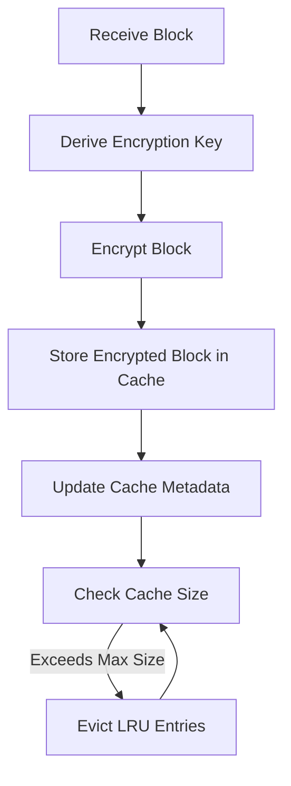

# P2P Network Design

This document describes the **detailed design** of the P2P network module for PQDOS, including architecture, components, and interactions.

---

## 🎯 **Design Goals**

1. **Decentralization**: No single point of failure. Blocks can be fetched from any peer in the network.
2. **Security**: All blocks are encrypted, and access is restricted to authorized users.
3. **Performance**: Local caching reduces latency and network load.
4. **Offline Operation**: Frequently accessed blocks are cached locally.
5. **Pluggability**: Components are abstracted behind traits for easy replacement (e.g., swap AES-256 for Kyber).

---

## 🏗️ **Architecture**

### **High-Level Overview**

```
┌───────────────────────────────────────────────────────────────────────────────┐
│                            PQDOS Node (Local)                                    │
├───────────────────────────────────────────────────────────────────────────────┤
│                                                                               │
│  ┌─────────────────────────────────────────────────────────────────────────┐  │
│  │                         P2P Module                                        │  │
│  ├─────────────────┬─────────────────┬─────────────────────────────────────┤  │
│  │  P2P Network    │  Block Fetcher   │  Cache Manager                      │  │
│  │                 │                  │                                     │  │
│  │ - Peer Mgmt     │ - Fetch blocks   │ - LRU Cache                         │  │
│  │ - Message Routing│   from network  │ - Encryption/Decryption             │  │
│  │ - Broadcast     │ - Permission     │ - Local Storage                     │  │
│  │                 │   checks         │                                     │  │
│  └─────────────────┴─────────────────┴─────────────────────────────────────┘  │
│                                                                               │
│  ┌─────────────────────────────────────────────────────────────────────────┐  │
│  │                         Blockchain Layer (Optional)                      │  │
│  │  - Verifies block integrity (via PQDOS blockchain)                     │  │
│  │  - Stores metadata (owner, permissions, etc.)                            │  │
│  └─────────────────────────────────────────────────────────────────────────┘  │
│                                                                               │
└───────────────────────────────────────────────────────────────────────────────┘
                              ▲
                              │ Network Messages
                              ▼
┌───────────────────────────────────────────────────────────────────────────────┐
│                            P2P Network (Other Peers)                            │
├───────────────────────────────────────────────────────────────────────────────┤
│  ┌─────────────┐    ┌─────────────┐    ┌─────────────┐                      │
│  │   Peer A    │    │   Peer B    │    │   Peer C    │                      │
│  │             │    │             │    │             │                      │
│  │ - Cache     │    │ - Cache     │    │ - Cache     │                      │
│  │ - P2P Layer │    │ - P2P Layer │    │ - P2P Layer │                      │
│  └─────────────┘    └─────────────┘    └─────────────┘                      │
└───────────────────────────────────────────────────────────────────────────────┘
```

---

## 📦 **Components**

### **1. P2P Network (`p2p/network.rs`)**

#### **Responsibilities**
- Manage peer connections.
- Send/receive network messages.
- Broadcast messages to all peers.
- Discover new peers (via `discovery` module).

#### **Key Types**
- `P2PNetworkImpl`: Main implementation of the P2P network.
- `NetworkMessage`: Enum for all network messages (e.g., `BlockRequest`, `BlockResponse`).

#### **Traits**
- `P2PNetwork`: Abstract interface for P2P networking.

---

### **2. Peer (`p2p/peer.rs`)**

#### **Responsibilities**
- Represent a peer in the network.
- Send/receive messages to/from the peer.
- Handle connection lifecycle (connect, disconnect, ping).

#### **Key Types**
- `P2PPeer`: Represents a peer with an ID, address, and TCP connection.
- `PeerAddress`: Wrapper around `SocketAddr` for peer addresses.

#### **Traits**
- `Peer`: Abstract interface for a peer.

---

### **3. Block Fetcher (`p2p/block_fetcher.rs`)**

#### **Responsibilities**
- Fetch blocks from the network or local cache.
- Verify user permissions before returning a block.
- Handle block requests and responses.

#### **Key Types**
- `P2PBlockFetcher`: Main implementation for fetching blocks.

#### **Traits**
- `BlockFetcher`: Abstract interface for block fetching.

---

### **4. Cache Manager (`p2p/cache/`)**

#### **Responsibilities**
- Store blocks locally in an encrypted cache.
- Manage cache eviction (LRU).
- Encrypt/decrypt blocks based on user permissions.

#### **Submodules**
- `lru.rs`: LRU cache implementation.
- `storage.rs`: Physical storage of blocks (filesystem).
- `crypto.rs`: Encryption/decryption logic.

#### **Key Types**
- `LRUCache`: LRU cache for blocks.
- `CacheEntry`: Metadata for a cached block (ID, path, size, owner, nonce).
- `BlockEncryptionKey`: Key and nonce for block encryption.

#### **Traits**
- `CacheManager`: Abstract interface for cache management.

---

### **5. Discovery (`p2p/discovery.rs`)**

#### **Responsibilities**
- Discover new peers in the network.
- Use mDNS for local discovery.
- Use DHT for global discovery (like BitTorrent).

#### **Status**
- ⏳ **TODO**: Not yet implemented.

---

## 🔄 **Data Flow**

### **1. Fetching a Block**

```mermaid
graph TD
    A[User Requests Block] --> B[Check Local Cache]
    B -->|Block in Cache| C[Verify Permissions]
    C -->|Has Permissions| D[Decrypt Block]
    D --> E[Return Block]
    C -->|No Permissions| F[Return None]
    B -->|Block Not in Cache| G[Request from P2P Network]
    G --> H[Broadcast BlockRequest]
    H --> I[Wait for BlockResponse]
    I --> J[Cache Block (Encrypted)]
    J --> B
```

### **2. Caching a Block**



---

## 🔐 **Encryption Design**

### **Key Derivation**
- Each block is encrypted with a **unique key** derived from:
  - The **owner's private key** (or a shared key).
  - The **`block_id`** (to ensure uniqueness per block).
- Key derivation uses **SHA3-256** (for simplicity; HKDF recommended for production).

### **Encryption Algorithm**
- **AES-256-GCM** is used for encryption (authenticated encryption).
- **Nonce**: 12-byte nonce for each block (stored in `CacheEntry`).
- **Key**: 32-byte key derived from owner's private key + block_id.

### **Access Control**
- A user can decrypt a block if:
  1. They are the **owner** of the block (verified via `owner_id`).
  2. They have been **explicitly shared** the block by the owner (via `shared_keys`).
- **No plaintext storage**: Blocks are **always encrypted** in the cache.

---

## 📡 **Network Protocol**

### **Message Types**

| Message | Description | Fields |
|---------|-------------|--------|
| `BlockRequest` | Request a block from the network. | `block_id`, `requester_id` |
| `BlockResponse` | Response with an encrypted block. | `block_id`, `encrypted_data`, `owner_id`, `nonce` |
| `BlockAvailability` | Announce block availability. | `block_id`, `peer_id` |
| `Ping` | Check peer connectivity. | `peer_id` |
| `Pong` | Response to ping. | `peer_id` |

### **Message Flow**

1. **Block Request**:
   - Peer A sends `BlockRequest` to all peers.
   - Peers with the block respond with `BlockResponse`.
   - Peer A caches the encrypted block and returns it to the user (if permissions allow).

2. **Block Availability**:
   - Peers periodically broadcast `BlockAvailability` to announce which blocks they have.
   - Used for peer discovery and load balancing.

3. **Ping/Pong**:
   - Used to check peer connectivity and latency.

---

## 🔧 **Traits and Interfaces**

### **1. `P2PNetwork` Trait**

```rust
#[async_trait]
pub trait P2PNetwork: Send + Sync {
    type Peer: Peer + Clone;
    
    async fn add_peer(&mut self, peer: Self::Peer) -> Result<(), Error>;
    async fn discover_peers(&self) -> Result<Vec<Self::Peer>, Error>;
    async fn broadcast(&self, message: NetworkMessage) -> Result<(), Error>;
    async fn send_to_peer(&self, peer_id: &str, message: NetworkMessage) -> Result<(), Error>;
    async fn listen(&mut self) -> Result<(), Error>;
}
```

### **2. `Peer` Trait**

```rust
#[async_trait]
pub trait Peer: Send + Sync {
    type Address: Send + Sync + Display;
    
    fn id(&self) -> &str;
    fn address(&self) -> &Self::Address;
    async fn send_message(&self, message: NetworkMessage) -> Result<(), Error>;
    async fn ping(&self) -> Result<bool, Error>;
}
```

### **3. `BlockFetcher` Trait**

```rust
#[async_trait]
pub trait BlockFetcher: Send + Sync {
    async fn fetch_block(
        &self, 
        block_id: &[u8], 
        user_id: &[u8],
        user_private_key: Option<&[u8]>, // For decrypting owned blocks.
        shared_keys: &HashMap<Vec<u8>, Vec<u8>>, // For shared blocks.
    ) -> Result<Option<SimpleBlock>, Error>;
    
    async fn has_block(&self, block_id: &[u8]) -> Result<bool, Error>;
}
```

### **4. `CacheManager` Trait**

```rust
#[async_trait]
pub trait CacheManager: Send + Sync {
    async fn cache_block(
        &mut self, 
        block: SimpleBlock, 
        owner_id: &[u8],
    ) -> Result<(), Error>;
    
    async fn get_cached_block(
        &self, 
        block_id: &[u8], 
        user_id: &[u8],
        user_private_key: Option<&[u8]>, // For decrypting owned blocks.
        shared_keys: &HashMap<Vec<u8>, Vec<u8>>, // For shared blocks.
    ) -> Result<Option<SimpleBlock>, Error>;
    
    async fn contains(&self, block_id: &[u8]) -> Result<bool, Error>;
    async fn remove_block(&mut self, block_id: &[u8]) -> Result<(), Error>;
    async fn cleanup(&mut self) -> Result<(), Error>;
    async fn size(&self) -> Result<u64, Error>;
}
```

---

## 📁 **File Structure**

```
src/p2p/
├── mod.rs              # Exports and documentation.
├── traits.rs           # Abstract traits (P2PNetwork, Peer, BlockFetcher, CacheManager).
├── peer.rs             # Peer implementation (P2PPeer).
├── network.rs          # Network messages and P2PNetworkImpl.
├── cache/
│   ├── mod.rs          # Cache module exports.
│   ├── lru.rs           # LRU cache implementation.
│   ├── storage.rs      # Physical storage (filesystem).
│   └── crypto.rs       # Encryption/decryption logic.
├── discovery.rs        # Peer discovery (TODO).
└── block_fetcher.rs    # Block fetching implementation.
```

---

## 🛡️ **Security Considerations**

### **1. Encryption**
- **All blocks are encrypted** before being stored in the cache.
- **AES-256-GCM** provides authenticated encryption (confidentiality + integrity).
- **Unique keys per block**: Each block is encrypted with a unique key derived from the owner's private key and the block_id.

### **2. Access Control**
- **Owner-based access**: Only the owner can decrypt their own blocks (using their private key).
- **Shared access**: Users can share blocks by providing the decryption key to other users.
- **No plaintext storage**: Blocks are **never stored in plaintext** in the cache.

### **3. Key Management**
- **Private keys**: Never stored in the system. Users must provide their private key to decrypt their own blocks.
- **Shared keys**: Stored in a `HashMap<Vec<u8>, Vec<u8>>` (block_id -> shared key). In production, this should be persisted securely.

### **4. Future Improvements**
- **Post-Quantum Cryptography**: Replace AES-256 with Kyber (for key exchange) and Dilithium (for signatures).
- **Hardware Security Modules (HSM)**: Store private keys in secure hardware.
- **Key Rotation**: Periodically rotate encryption keys for enhanced security.

---

## 📊 **Performance Considerations**

### **1. Caching**
- **LRU Eviction**: Least Recently Used blocks are evicted when the cache is full.
- **Cache Size**: Configurable (default: 100 MB).
- **Encryption Overhead**: AES-256-GCM adds minimal overhead (~10-20% for small blocks).

### **2. Network**
- **Broadcasting**: Block requests are broadcast to all peers. In production, use a more efficient routing mechanism (e.g., DHT).
- **Parallel Fetching**: Fetch multiple blocks in parallel to improve performance.

### **3. Storage**
- **Filesystem**: Blocks are stored as files in `/tmp/pqdos_cache/`.
- **Compression**: Consider adding compression (e.g., zstd) to reduce storage usage.

---

## 🧪 **Testing**

### **Unit Tests**
- Test encryption/decryption (`p2p/cache/crypto.rs`).
- Test cache operations (`p2p/cache/lru.rs`).
- Test peer messaging (`p2p/peer.rs`).

### **Integration Tests**
- Test block fetching from cache and network.
- Test permission checks.
- Test concurrent access.

### **Network Tests**
- Simulate a network with multiple peers.
- Test block requests/responses.
- Test error handling (e.g., peer disconnects, block not found).

---

## 📚 **References**

- [PQDOS Architecture](../../ARCHITECTURE.md)
- [PQDOS Manual](../../MANUAL.md)
- [AES-GCM Specification](https://nvlpubs.nist.gov/nistpubs/Legacy/SP/nistspecialpublication800-38d.pdf)
- [SHA3 Specification](https://nvlpubs.nist.gov/nistpubs/FIPS/NIST.FIPS.202.pdf)
