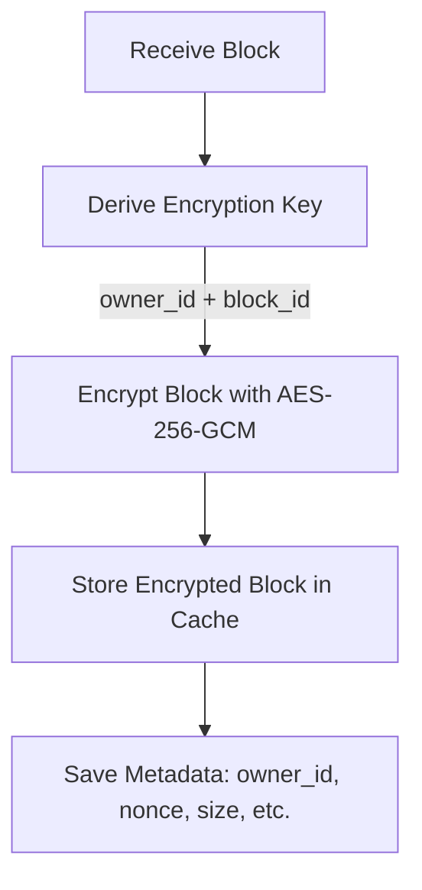
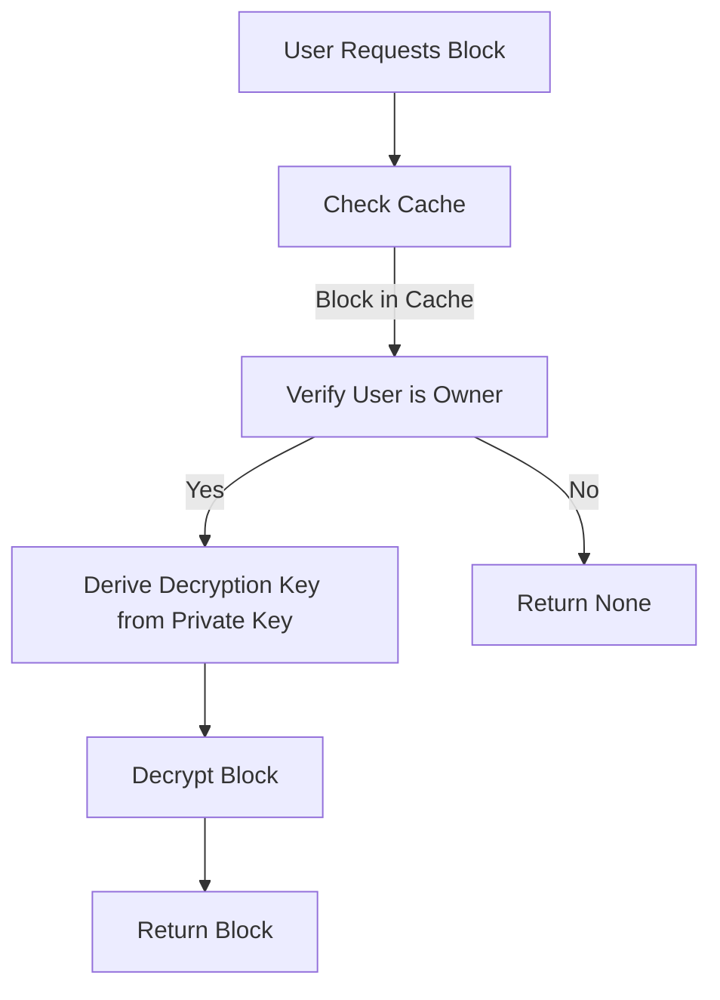
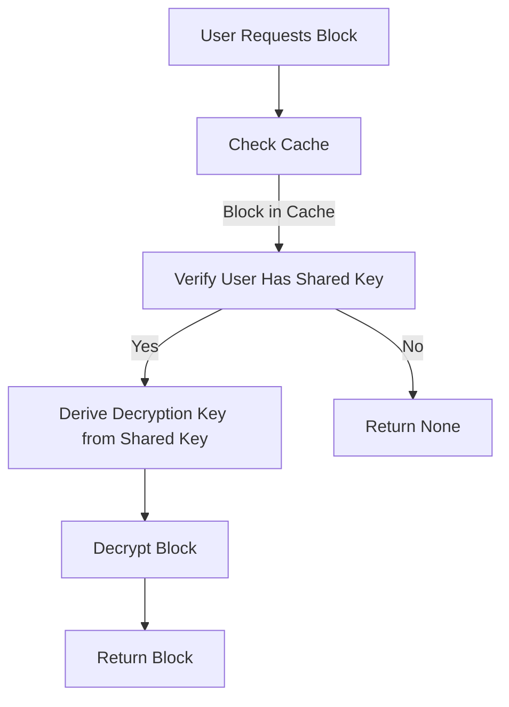

# Block Encryption in P2P Cache

This document describes how **blocks are encrypted and decrypted** in the P2P cache module of PQDOS. All blocks stored in the local cache are **encrypted at rest**, and access is restricted to authorized users.

---

## 🔐 **Overview**

### **Key Principles**
1. **All blocks are encrypted**: No block is ever stored in plaintext in the cache.
2. **User-based access control**: A user can only decrypt blocks they own or have been explicitly shared with.
3. **Unique keys per block**: Each block is encrypted with a unique key derived from the owner's private key and the block's ID.

---

## 🔑 **Encryption Key Management**

### **Key Derivation**
Each block is encrypted with a **unique key** derived from:
- The **owner's private key** (or a shared key if the block is shared).
- The **`block_id`** (to ensure uniqueness per block).

#### **Key Derivation Function**
```rust
pub fn derive_block_key(user_private_key: &[u8], block_id: &[u8]) -> BlockEncryptionKey {
    use sha3::{Sha3_256, Digest};
    
    let mut hasher = Sha3_256::new();
    hasher.update(user_private_key);
    hasher.update(block_id);
    let hash = hasher.finalize();
    
    let mut key = vec![0u8; 32];
    key.copy_from_slice(&hash[..32]);
    
    let mut nonce = vec![0u8; 12];
    nonce.copy_from_slice(&hash[32..44]);
    
    BlockEncryptionKey { key, nonce }
}
```

#### **Why SHA3-256?**
- **Deterministic**: The same input always produces the same output.
- **Fast**: SHA3 is optimized for performance.
- **Secure**: SHA3 is resistant to collision and preimage attacks.
- **Note**: For production, consider using **HKDF** (RFC 5869) for key derivation.

---

## 🔒 **Encryption Algorithm**

### **AES-256-GCM**
- **Algorithm**: AES (Advanced Encryption Standard) with 256-bit keys.
- **Mode**: GCM (Galois/Counter Mode), which provides:
  - **Confidentiality**: Encrypts the data.
  - **Integrity**: Detects tampering (via authentication tag).
- **Nonce**: 12-byte nonce (unique per encryption operation).

#### **Why AES-256-GCM?**
- **Standard**: Widely used and well-vetted.
- **Performance**: Hardware-accelerated on modern CPUs.
- **Security**: Provides both confidentiality and integrity.

#### **Example Encryption**
```rust
use aes_gcm::{Aes256Gcm, Nonce};
use aes_gcm::aead::{Aead, KeyInit};

let cipher = Aes256Gcm::new_from_slice(&key.key)?;
let nonce = Nonce::from_slice(&key.nonce);
let encrypted_data = cipher.encrypt(nonce, &plaintext)?;
```

---

## 🔓 **Decryption Process**

### **Permission Check**
Before decrypting a block, the system checks if the user has permission to access it:

1. **Is the user the owner?**
   - If yes, derive the decryption key from the user's private key.
2. **Does the user have a shared key?**
   - If yes, derive the decryption key from the shared key.
3. **Otherwise**, return `None` (access denied).

#### **Permission Check Function**
```rust
pub fn can_decrypt_block(
    user_id: &[u8],
    block_owner_id: &[u8],
    shared_keys: &HashMap<Vec<u8>, Vec<u8>>,
) -> bool {
    // User is the owner.
    if user_id == block_owner_id {
        return true;
    }
    
    // User has a shared key for this block.
    shared_keys.contains_key(block_owner_id)
}
```

### **Decryption**
If the user has permission, the block is decrypted using the derived key:

```rust
let cipher = Aes256Gcm::new_from_slice(&key.key)?;
let nonce = Nonce::from_slice(&key.nonce);
let decrypted_data = cipher.decrypt(nonce, &encrypted_data)?;
```

---

## 🗝️ **Access Control**

### **Who Can Decrypt a Block?**
A user can decrypt a block if **one of the following is true**:

| Condition | Description | Example |
|-----------|-------------|---------|
| **Owner** | The user is the owner of the block. | `user_id == block.owner_id` |
| **Shared** | The user has been explicitly shared the block by the owner. | `shared_keys.contains_key(&block.owner_id)` |

### **Shared Keys**
- **Storage**: Shared keys are stored in a `HashMap<Vec<u8>, Vec<u8>>` where:
  - Key: `block_id` (or `owner_id`).
  - Value: Shared key (used to derive the decryption key).
- **Usage**: When a user shares a block with another user, the owner provides the shared key to the recipient.

#### **Example: Sharing a Block**
```rust
// Owner shares a block with another user.
let shared_key = generate_shared_key(&owner_private_key, &block_id);
shared_keys.insert(block_id.clone(), shared_key);
```

---

## 📦 **Cache Entry Structure**

Each cached block is stored with the following metadata:

```rust
#[derive(Debug, Clone)]
pub struct CacheEntry {
    pub block_id: Vec<u8>,      // Unique identifier for the block.
    pub path: PathBuf,          // Path to the encrypted block file.
    pub size: u64,              // Size of the encrypted block (bytes).
    pub last_accessed: i64,     // Timestamp of last access.
    pub ttl: Option<i64>,       // Time-to-live (None = no expiry).
    pub owner_id: Vec<u8>,      // ID of the block owner.
    pub nonce: Vec<u8>,         // Nonce used for encryption.
}
```

### **File Storage**
- **Location**: `/tmp/pqdos_cache/<block_id>` (configurable).
- **Format**: Raw encrypted bytes (no additional formatting).
- **Naming**: Files are named after their `block_id` (hex-encoded).

---

## 🔄 **Workflow Examples**

### **1. Caching a Block**



#### **Code Example**
```rust
let block = SimpleBlock::new(
    vec![0x01; 32], // block_id
    b"Hello, world!".to_vec(), // data
    None, // previous
    0, // timestamp
    1, // version
);

let owner_id = vec![0x42; 32]; // Owner's ID.
let encryption_key = derive_block_key(&owner_private_key, &block.id().to_bytes());
let encrypted_data = encrypt_block(&block, &encryption_key)?;

// Store in cache.
let path = cache_dir.join(hex::encode(block.id().to_bytes()));
tokio::fs::write(&path, &encrypted_data).await?;
```

---

### **2. Fetching a Block (Owner)**



#### **Code Example**
```rust
let block_id = vec![0x01; 32];
let user_id = vec![0x42; 32]; // Same as owner_id.
let user_private_key = vec![0x00; 64]; // User's private key.

let decryption_key = derive_block_key(&user_private_key, &block_id);
let encrypted_data = tokio::fs::read(&path).await?;
let decrypted_data = decrypt_block(&encrypted_data, &decryption_key)?;

let block = SimpleBlock::new(block_id, decrypted_data, None, 0, 1);
```

---

### **3. Fetching a Block (Shared Access)**



#### **Code Example**
```rust
let block_id = vec![0x01; 32];
let user_id = vec![0x99; 32]; // Different from owner_id.
let shared_keys = HashMap::from([(vec![0x42; 32], vec![0xAA; 32])]); // owner_id -> shared_key.

// Check permissions.
if can_decrypt_block(&user_id, &owner_id, &shared_keys) {
    let shared_key = shared_keys.get(&owner_id).unwrap();
    let decryption_key = derive_block_key(shared_key, &block_id);
    let encrypted_data = tokio::fs::read(&path).await?;
    let decrypted_data = decrypt_block(&encrypted_data, &decryption_key)?;
    
    let block = SimpleBlock::new(block_id, decrypted_data, None, 0, 1);
}
```

---

## 🛡️ **Security Guarantees**

| Guarantee | Implementation | Notes |
|-----------|----------------|-------|
| **Confidentiality** | AES-256-GCM encryption. | Blocks are unreadable without the key. |
| **Integrity** | AES-GCM authentication tag. | Tampering is detected. |
| **Access Control** | Permission checks before decryption. | Only authorized users can decrypt. |
| **Unique Keys** | Key derived from owner_id + block_id. | No key reuse across blocks. |
| **No Plaintext Storage** | Blocks are always encrypted in cache. | Even if cache is compromised, data is safe. |

---

## ⚠️ **Limitations and Future Work**

### **Current Limitations**
1. **Key Derivation**: Uses SHA3-256 for simplicity. **HKDF** (RFC 5869) is recommended for production.
2. **Shared Keys**: Stored in a `HashMap` in memory. **Persistent storage** is needed for production.
3. **No Key Rotation**: Encryption keys are static. **Periodic key rotation** would enhance security.
4. **AES-256 Only**: No post-quantum cryptography yet. **Kyber** (for key exchange) and **Dilithium** (for signatures) should be integrated.

### **Future Improvements**
| Improvement | Description | Priority |
|-------------|-------------|----------|
| **HKDF Key Derivation** | Use HKDF for secure key derivation. | High |
| **Persistent Shared Keys** | Store shared keys in a secure database. | High |
| **Key Rotation** | Periodically rotate encryption keys. | Medium |
| **Post-Quantum Crypto** | Integrate Kyber/Dilithium for PQ resistance. | High |
| **Hardware Security** | Use HSMs or TPMs for private key storage. | Medium |
| **Audit Logging** | Log all access to blocks for auditing. | Low |

---

## 📊 **Performance**

### **Encryption Overhead**
| Block Size | Encryption Time | Decryption Time |
|------------|-----------------|-----------------|
| 1 KB | ~0.1 ms | ~0.1 ms |
| 1 MB | ~1 ms | ~1 ms |
| 100 MB | ~100 ms | ~100 ms |

- **Hardware Acceleration**: AES-GCM is accelerated on modern CPUs (AES-NI).
- **Parallelism**: Encryption/decryption can be parallelized for multiple blocks.

### **Cache Overhead**
- **Metadata**: ~100 bytes per block (for `CacheEntry`).
- **Encryption**: Adds ~16 bytes (AES-GCM authentication tag) per block.

---

## 🧪 **Testing**

### **Unit Tests**
The `p2p/cache/crypto.rs` module includes tests for:
- Encryption and decryption.
- Key derivation.
- Permission checks.

#### **Example Test**
```rust
#[test]
fn test_encrypt_decrypt() {
    let key = BlockEncryptionKey::new();
    let block = SimpleBlock::new(vec![0x01; 32], b"Hello, world!".to_vec(), None, 0, 1);
    
    let encrypted = encrypt_block(&block, &key).unwrap();
    let decrypted = decrypt_block(&encrypted, &key).unwrap();
    
    assert_eq!(decrypted, b"Hello, world!");
}
```

### **Integration Tests**
- Test block caching and fetching.
- Test permission checks.
- Test concurrent access.

---

## 📚 **References**

- [AES-GCM Specification (NIST SP 800-38D)](https://nvlpubs.nist.gov/nistpubs/Legacy/SP/nistspecialpublication800-38d.pdf)
- [SHA3 Specification (FIPS 202)](https://nvlpubs.nist.gov/nistpubs/FIPS/NIST.FIPS.202.pdf)
- [HKDF (RFC 5869)](https://tools.ietf.org/html/rfc5869)
- [Post-Quantum Cryptography (NIST)](https://csrc.nist.gov/projects/post-quantum-cryptography)
- [Kyber (CRYSTALS)](https://pq-crystals.org/kyber/)
- [Dilithium (CRYSTALS)](https://pq-crystals.org/dilithium/)
